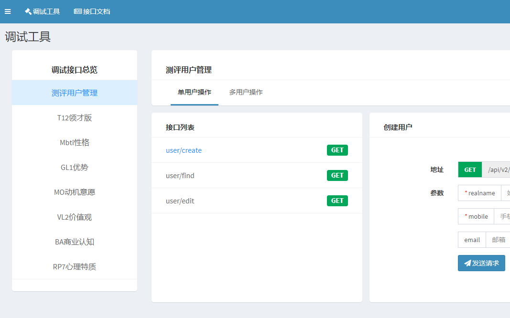

# config介绍

## 介绍

**`config/Inside/apiauth`**权限组织结构，3层结构：

* 顶层是版本名称，需要跟**`queries`**里的name字段对应，例如：excellent、profession；
* 中间层主要分为**`base`**和**`advanced`**，即分为基础功能权限和高级功能权限，原则上还可以继续加其它分组；
* 底层为具体功能分类，例如：测评码接口、答题接口、报告接口；
* 每层结构使用**`apiPermitObject()`**函数来构造，第一个位置放中文名，第二个位置放英文名，第三个位置包住下一层的数组；

**`config/Inside/apidebug`**API调试工具配置：

* 与**`config/Inside/ApiData`**文件夹协同工作；
* 只需要依据正确的格式加载，就可以实现带权限隔离的API调试器，权限是permit字段，对**`config/Inside/apiauth`**中的权限进行使用；

