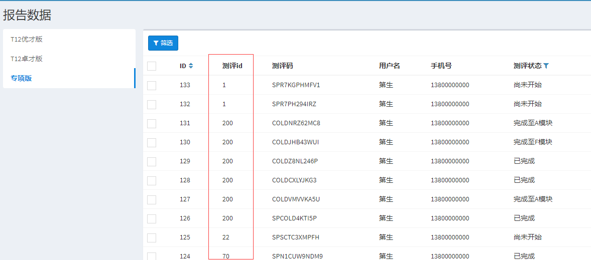

# 自定义一个测评码列表

## 背景介绍

**`config/Inside/queries`**自定义一个新的测评码列表，一般情况下假如直接添加新的配置就可以创建出对应的测评码列表，但当需要自定义添加字段，或对某些字段的内容展示进行变更则需要自定义。

例如，专项测评有一个特殊字段`question_id`，跟以往的测评版本不一样：



## 实现过程

* 首先，找到`Insider\QueriesController`，并插入一个`xxxList()`;

```php
public function xxxList() ($modelName,$reportType) {
    ...
}
```

* 接着，我们需要搞清楚这个xxxList应该如何命名，因为这是自动加载的，所以命名不能太随意；

> _命名规则：_链接入口名字小写+"List"

* 例子：在**`queries`**中的name字段有**`'t12-excellent' => 'T12卓才版'`**，那么这个xxxList就应该叫做**`t12excellentList()`**
* 具体逻辑代码的实现，请依据[laravel-admin中的Grid实现](https://laravel-admin.org/docs/zh/model-grid)；

